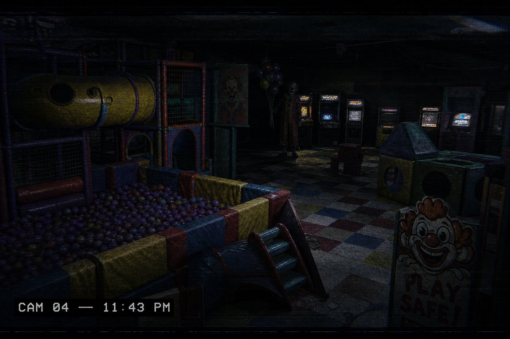

# CLOWN HOUSE: AFTER HOURS

> *"The party ended. They didn't."*

A complete concept + **playable prototype** of a multiplayer (1–6) Roblox horror game
set in HappyLand, an abandoned indoor family fun center. Childhood nostalgia,
gone wrong: colorful soft-play, ball pits, arcade machines… and five clowns still
following the *party protocol* — because nobody ever wrote the stop condition.



---

## What's in this package

| Path | What it is |
|---|---|
| **`index.html`** | **The playable prototype** — first-person browser build (Three.js, zero install). Served by the live preview (or any static server from this folder). |
| `js/` | Prototype source: grid/map, world builder, clown AI, procedural WebAudio, UI, story engine. |
| `docs/GAME_DESIGN.md` | The full concept document: story, all 5 clowns, 5 chapters, map, puzzles, events, AI, audio, UI spec, endings, replayability, balancing. |
| `docs/keyart.jpg` | Key art. |
| `roblox/` | Roblox Studio/Luau implementation: config, net registry, RoundManager, ObjectiveService, shared ClownAI, client HUD. See `roblox/README.md`. |
| `validate-map.mjs` | Headless map-integrity test (`node validate-map.mjs`): every objective/patrol point reachability check. |

## Playing the prototype

Open the live preview (port 8000, this folder served statically) and press **PLAY**.

```
WASD move · Mouse look (click to capture) · SHIFT sprint · E interact/hide
F flashlight · C security monitors · TAB collected lore · ESC pause
```

**The full arc is playable:** flashlight → fuses → breaker → **PARTY MODE** →
tickets (Tickets is watching the arcade economy) → prize → 3 simultaneous
party buttons (Mimic starts copying you) → maintenance → PartyKeeper + shutdown
code → the yellow door → candles → final chase → **4 endings** (A escape /
B shutdown / C the party / D secret, needs all 4 VHS tapes).

First catch = downed (mash E). Second catch = the party keeps you.

## Clown roster (playable behaviors)

- **BOBBY** — balloons are his sensors; a balloon drifting at you means he's near. Pop them and he gets faster… and finds you.
- **TICKETS** — territorial, counts theft, not footsteps. Greed makes him leave the prize corner. Flashlight beam stuns him.
- **MIMIC** — appears as *your* explorer tag, perfectly still, where you aren't. Don't let it close.
- **JINGLE** — audio presence: when the music stops, he's close.
- **MR. HAPPY** — the host. PA, TV, lights, locks. Physically appears once. You'll know when.

## Engineering notes

- No external assets: geometry is procedural, all audio synthesized via WebAudio,
  poster/clown faces are runtime canvas textures. Works offline from a static host.
- Map integrity is enforced by `validate-map.mjs` (BFS reachability incl. doors/patrols).
- The Roblox build maps 1:1 to these systems — see `docs/GAME_DESIGN.md` §20
  (prototype coverage map).

---

*HappyLand, PartyKeeper, Bobby, Jingle, Mimic, Tickets and Mr. Happy are original
creations for this project — inspired by the *feeling* of places like Dutch indoor
playgrounds, with no copied branding, names, layouts, or assets.*
